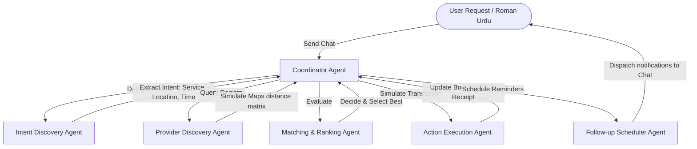

# Antigravity AI - Service Orchestrator for Pakistan's Informal Economy

An Agentic AI booking orchestration system powered by **Google Antigravity** simulation, designed specifically for informal services in Pakistan (electricians, plumbers, AC repairmen, tutors, beauticians).

This project features a high-fidelity client-side interface built with **React**, **TypeScript**, and **Vite**, demonstrating the end-to-end automated lifecycle of a service request from natural language intent understanding to provider ranking, automated booking, and follow-up.

---

## 🚀 Key Features

1. **Multi-Agent Orchestrator Pipeline (Google Antigravity Simulation)**:
   - **Coordinator Agent**: Receives client messages, maps out execution steps, and routes communications.
   - **Intent Discovery Agent (NLP)**: Parses Roman Urdu, Urdu script, and English queries (e.g., *"kal subah G-13 me ac technician chahye"*).
   - **Provider Discovery Agent**: Interfaces with a simulated Maps API to calculate geographic distances (Haversine formula) to available providers from the user's sector.
   - **Matching & Ranking Agent**: Evaluates candidates using a multi-criteria scoring algorithm (balancing rating, distance, price, and experience).
   - **Action Execution Agent**: Books the provider, updates the system ledger, and generates a printable transaction receipt.
   - **Follow-up Scheduler Agent**: Runs a visual scheduler queue to fire reminders, transit updates, job completion statuses, and rating prompts in real-time.

2. **Dual-Mode NLP Parsing**:
   - **Local Parser**: Zero-config dictionary and regex extraction supporting local dialects, sector abbreviations (e.g., G-13, F-11, I-8, DHA), and time concepts (*kal subah*, *shaam*, *abhi*).
   - **Live Gemini Integration**: Toggle input field in the header to run live natural language parsing using Google's **Gemini 2.5 Flash** models for full semantic extraction.

3. **High-Fidelity UI/UX Dashboard**:
   - **Mobile Simulator Frame**: An interactive phone bezel representing the client's mobile app showing live chat interactions with the assistant, booking receipt attachments, and scheduled notifications.
   - **Antigravity reasoning trace**: Live logs of agent thoughts, decisions, score breakdowns, and tool invocations.
   - **Agent-to-Agent Messaging**: Traceable log of communications passed between agent modules (e.g. Coordinator ➡️ Ranker).
   - **Interactive Location Map**: Custom Islamabad sector map placing sector markers and highlighting selected provider routes.
   - **Database Ledger Monitor**: Real-time view of providers registry state and the follow-up cron scheduler queue.

---

## 🛠️ System Architecture



---

## 📦 Getting Started

### Prerequisites
- Node.js (v18+)
- npm

### Installation & Run
1. Navigate to the project root:
   ```bash
   cd c:\Users\Fahad\Desktop\agenticAI
   ```
2. Install dependencies:
   ```bash
   npm install
   ```
3. Launch the development server:
   ```bash
   npm run dev
   ```
4. Open the displayed URL (usually `http://localhost:5173`) in your browser.

---

## 📝 Tested Input Scenarios

Try typing the following messages in the simulated phone or click the quick test scenario chips:

- **AC technician G-13 (Roman Urdu)**:
  `Mujhe kal subah G-13 mein AC technician chahiye`
- **Plumber I-8 (Urdu Script)**:
  `مجھے کل صبح آئی-8 میں ایک پلمبر کی ضرورت ہے`
- **Electrician F-11 (English)**:
  `I need an electrician in F-11 sector right now, fan is not working`
- **Tutor H-12 (Roman Urdu)**:
  `H-12 me math parhane k liye kal shaam tutor chahye`
- **Beautician F-7 (Roman Urdu)**:
  `F-7 sector me makeup k liye beautician chahye`

---

## ⚙️ How Antigravity is Simulated

The orchestration runs in `src/agentEngine.ts`. It acts as an asynchronous processor that executes sequential agent turns. Delays are simulated so the user can visually track the agent node updates, reasoning logs, agent-to-agent message boards, map pin positioning, and scheduled updates in the task list.

- **Geographical Scenarios**: Anchored sector coordinates are located in Islamabad sector maps (G-13, F-11, I-8, etc.) and distances are calculated dynamically to simulate a real Places lookup.
- **Visual Chronology**: The scheduler queue displays remaining virtual seconds. When a timer expires, the status is marked as dispatched, and a chat prompt or SMS is simulated inside the mobile emulator chat feed.
